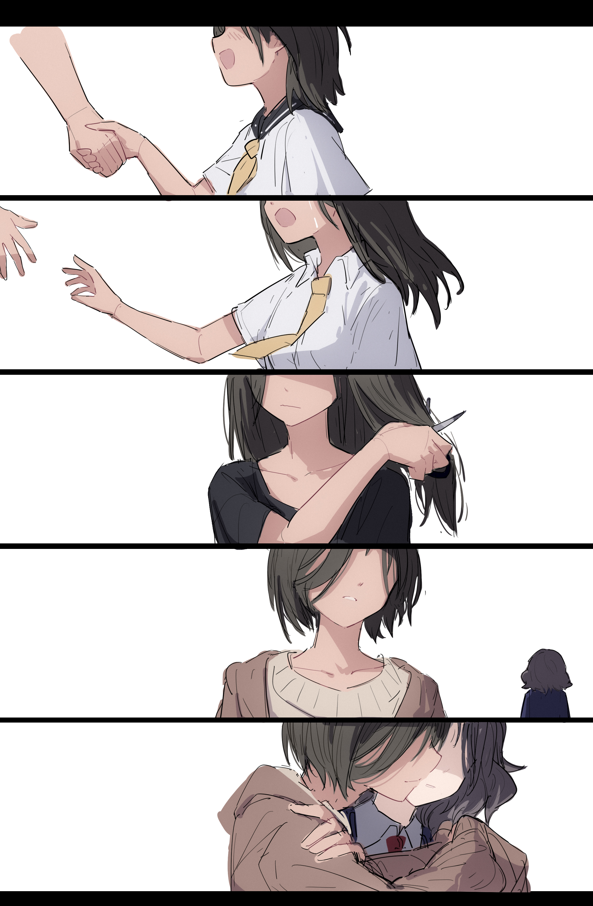

<!DOCTYPE html>
<html>
<head> 
<meta charset="utf-8"> 
</head>
 

 

<h2 style="margin-bottom:0;" id="hi-im-nekopara70622-%F0%9F%91%8B">Hi I'm @nekopara70622👋</h2>

 

 
  <li>🔭 I’m currently working on kitty314</li> 
  <li>🌱 I’m currently learning kitty314</li> 
  <li>👯 I’m looking to collaborate on kitty314</li> 
  <li>🤔 I’m looking for help with kitty314</li> 
  <li>💬 Ask me about kitty314</li> 
  <li>📫 How to reach me: kitty314</li> 
  <li>😄 Pronouns: kitty314</li> 
  <li>⚡ Fun fact: kitty314</li> 
  

 

  

 
 

 
</html>